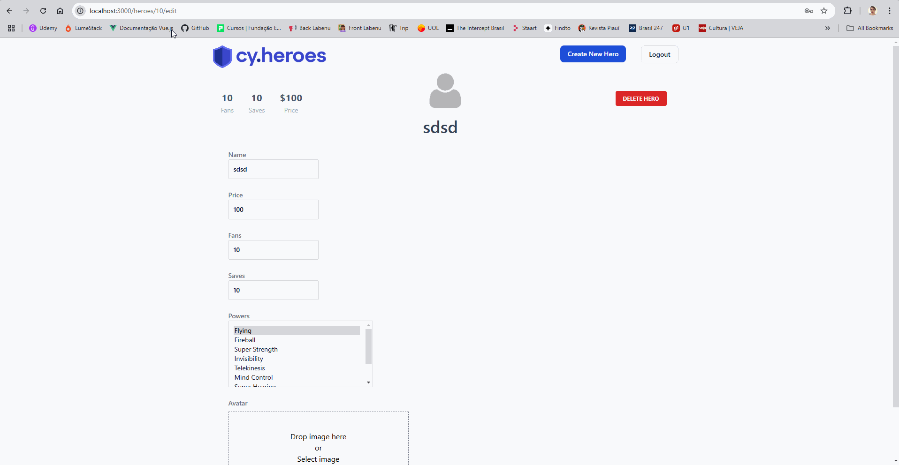

### Descrição:
Como usuário admin, quando entro pra editar um hero visualizo o botão "Delete hero" e ao clicar nele o hero é deletado e some da tela inicial, porém nada acontece na tela aonde estamos editando, o que causa a impressão de que a solicitação não foi completada. Além disso, eu consigo clicar no botão várias vezes e solicitar a deleção novamente, como se o hero já não tivesse sido deletado.

### Evidência:

### Passos para reproduzir:
1. Faça o login como usuário admin
2. Clique no "Lápis" de um dos heroes
3. Clique no botão "Delete hero" e observe o comportamento

### Resultado esperado:
Ao deletar um hero o usuário deveria visualizar alguma mensagem de sucesso em tela, ou ser redirecionado para início. Além disso, como ele já apagou o hero, ele não deveria conseguir clicar no botão de "Delete hero" novamente.

### Resultado obtido:
O usuário permace na tela do hero que ele acabou de deletar e consegue clicar no botão de "Delete hero" várias vezes, mesmo já tendo o deletado.

### Ambiente:
- Produção
- Chrome
- Resolução: 1920 x 1080

### Prioridade:
- Alta